# Predicting Car Categories and Purchase Prices: A Machine Learning Approach to Consumer Behavior Analysis

## Project Overview

In 2023, approximately 1.76 million cars were sold in Canada, marking a 12.9% year-over-year increase. Understanding customer preferences and spending behavior is critical for businesses to remain competitive and capture revenue in this growing market.

This project utilizes a clustering model to classify potential buyers into various car categories (e.g., SUV, Hatchback) by leveraging demographic data like age, income, and gender. Additionally, it employs a regression model to predict how much a customer might spend on a vehicle based on income, region, and gender. These insights will enable businesses to tailor their marketing and pricing strategies effectively.

The question this project aims to address is:

#### 1. Which car category (e.g., SUV vs sedan) a customer is likely to purchase based on demographic factors and historical purchase data?

The focus is on using machine learning techniques to classify which car category (e.g., SUV, sedan) a customer is likely to purchase based on demographic factors such as age, income, gender, and historical purchase data. The goal is to build an accurate predictive model that assists in understanding consumer preferences. Dealerships can use these insights to tailor their marketing strategies for different customer groups.

## Team Members (GitHub Username)

- Aadil Shaikh ([aadil-shaikh786](https://github.com/aadil-shaikh786))
- Felipe Bastos ([fbastos231](https://github.com/fbastos231))
- Shayan Hodai ([ShayanHodai](https://github.com/ShayanHodai))
- Si Jiao Liu ([sijiao-liu](https://github.com/sijiao-liu))
- Xuan (Heather) Wu ([lookatme818](https://github.com/lookatme818))

#### Final code can be found here: 
[https://github.com/sijiao-liu/customer-car-prediction/Classification Model - fbastos.ipynb](https://github.com/sijiao-liu/customer-car-prediction/blob/e1fe0cf53164f5773a52b790a00428914b48add7/code/Classification%20Model%20-%20fbastos.ipynb)

## Dataset

The dataset for this project is from Kaggle: [Car Sales Report Dataset](https://www.kaggle.com/datasets/missionjee/car-sales-report). It provides comprehensive data on automotive sales transactions, including customer demographics, dealer information, and vehicle specifics. Below is a detailed breakdown of the collected data and its relevance to our research objectives.

#### Attributes of the Dataset
The dataset contains the following key columns, each representing important information related to car sales:

| Variable Name     | Data Type | Description                                                   |
|-------------------|-----------|---------------------------------------------------------------|
| `Car_id`          | String    | Unique identifier for each car in the dataset.               |
| `Date`            | Datetime  | The date of the transaction (format: MM/DD/YYYY).            |
| `Customer Name`   | String    | Name of the customer who purchased the vehicle.              |
| `Gender`          | String    | Gender of the customer (e.g., Male).                         |
| `Annual Income`   | Integer   | Annual income of the customer (in local currency).           |
| `Dealer_Name`     | String    | Name of the car dealership where the sale was made.          |
| `Company`         | String    | Manufacturer or company of the car (e.g., Ford, Cadillac).   |
| `Model`           | String    | The specific model of the car sold (e.g., Expedition).       |
| `Engine`          | String    | Type of engine (e.g., Overhead Camshaft).                    |
| `Transmission`    | String    | Type of transmission (e.g., Auto, Manual).                   |
| `Color`           | String    | The color of the vehicle sold (e.g., Black, Red).            |
| `Price ($)`       | Integer   | Price of the car in dollars.                                 |
| `Dealer_No`       | String    | Unique identifier for the dealership.                        |
| `Body Style`      | String    | The body style of the vehicle (e.g., SUV, Hatchback).        |
| `Phone`           | String    | Phone number associated with the dealership.                 |
| `Dealer_Region`   | String    | Geographical region of the dealership (e.g., Middletown).    |

## Data Exploration

### Descriptive Statistics (Numerical Features)

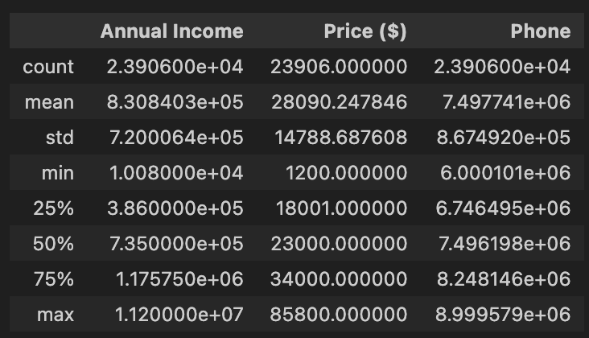

- **Average Annual Income**: $830,840
- **Average Car Price**: $28,090
- **Income Range**: $10,080 to $11,200,000

### Data Types and Null Values

  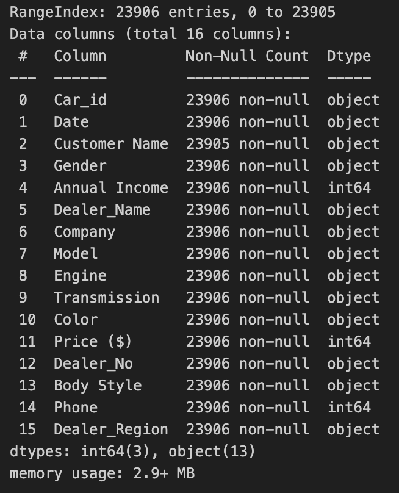

- **Number of Entries**: 23,906
- **Number of Features**: 16
- **Missing Values**: Most features are categorical, with no significant missing values except for one entry in `Customer Name`, which is not used in the analysis.

### Interesting Insights

INSIGHTS DESCRIPTION TO BE ADDED HERE

**Distribution of Vehicle Prices**
  - **Purpose**: This graph showcases the distribution of car prices across different vehicles in the dataset.
  - **What It Means**:
    - The price distribution is right-skewed, indicating that most vehicles are in the lower price range, while a few high-end vehicles push the tail of the distribution upward.
    - This insight helps businesses understand pricing clusters and focus on the most commonly purchased price ranges.
     

  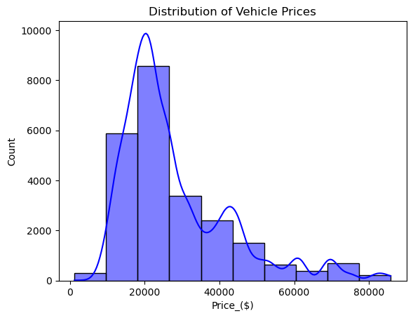

**Average Price by Body Style**
  - **Purpose**: This graph highlights the average prices of different car body styles (e.g., SUVs, sedans).
  - **What It Means**:
    - SUVs have the highest average price, followed by passenger vehicles and hatchbacks.
    - Dealerships can use this information to target customers differently based on their budget preferences for various car categories.

  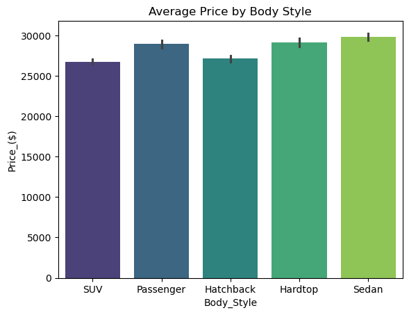

**Average Price by Body Style**
  - **Purpose**: This visualization provides insights into how vehicle sales trends evolve over time.
  - **What It Means**:
    - Peaks and troughs in the data could correlate with seasonal sales trends, promotions, or economic factors.
    - Understanding these trends can help businesses optimize inventory and promotional strategies during high-demand periods.

  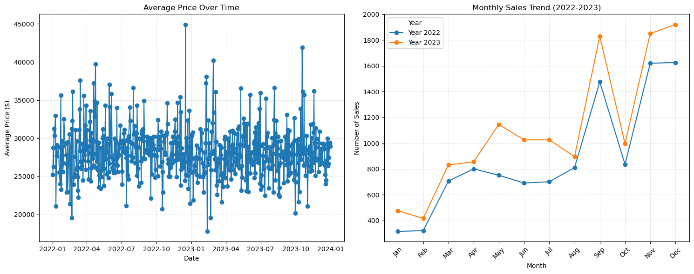

**Correlation Heatmap**
  - **Purpose**: This heatmap illustrates the relationships between numerical variables in the dataset.
  - **What It Means**:
    - A moderate positive correlation is observed between `Annual Income` and `Price ($)`, suggesting that higher-income customers tend to purchase more expensive cars.
    - Other features, such as `Dealer Region` and `Body Style`, show weaker correlations, emphasizing their less significant role in price prediction.
      

  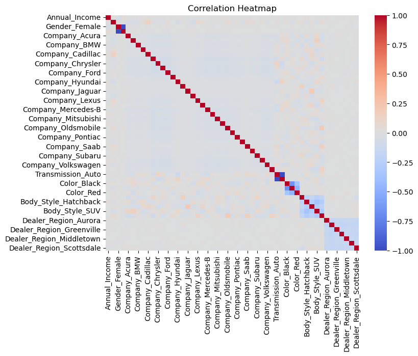

## Data Preprocessing

STEPS TAKEN FOR PREPOCESSING TO BE ADDED HERE

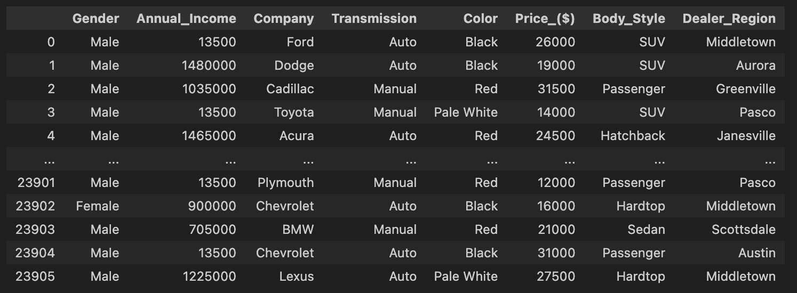

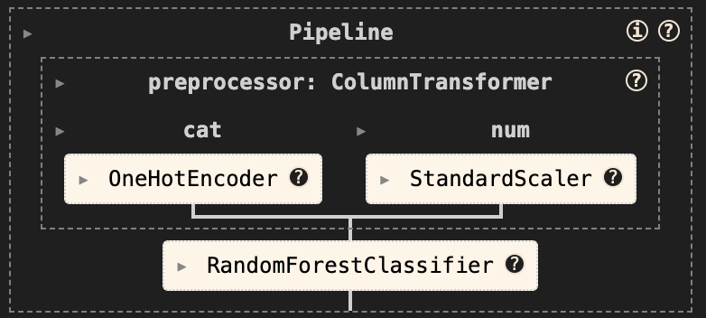

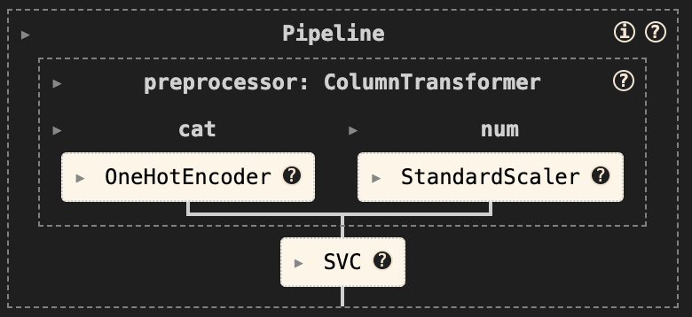

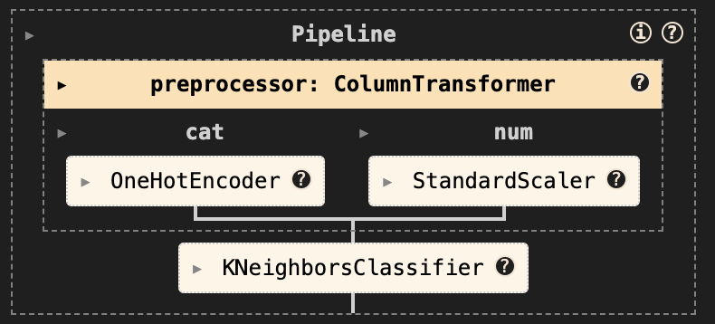

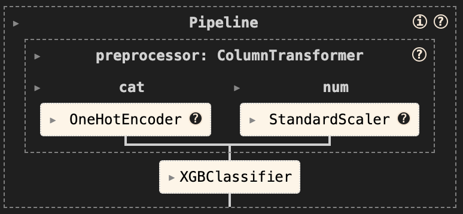

## Model Selection

STEPS TAKEN FOR MODEL SELECTION TO BE ADDED HERE (TRAIN/TEST SPLIT, TRAINING ACCURACY & CLASSIFICATION REPORT RESULTS)

## Hyperparameter Tuning

STEPS TAKEN FOR TUNING USING GRIDSEARCH TO BE ADDED HERE (EXPLAIN THE PARAMETERS TUNED)

## Evaluate Final Model

## Conclusion

CONCLUSION TO BE ADDED

## Future Work

Improvements to classification model:

- Add validation split as well (75% training, 10% validation, 15% testing)
- Add ROC/AUC curves & Metrics progression chart (Bar char of bar charts)

Using a regression model to to predict customer spending Behavior based on Income, Gender, and Region:

- This part of the project would aim at developing a regression model to predict how much a customer is likely to spend on a vehicle. It analyzes key features such as income, gender, region, and other socio-economic variables to model the spending patterns of car buyers.

## References

https://www.consumeraffairs.com/automotive/how-big-is-the-automotive-industry.html#key-insights

https://www.statista.com/statistics/423012/motor-vehicle-sales-in-canada/#:~:text=Canadian%20motorists%20purchased%20around%201.76%20million%20new%20motor%20vehicles%20in%202023.

