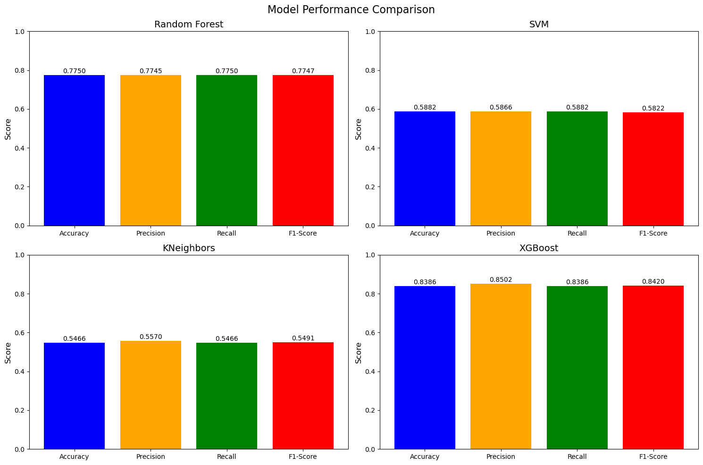
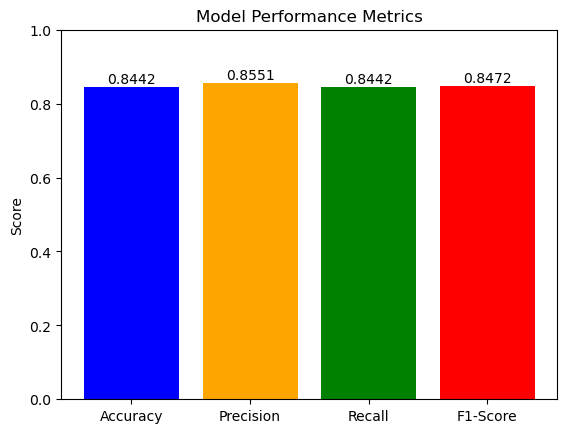

# Predicting Car Categories and Purchase Prices: A Machine Learning Approach to Consumer Behavior Analysis

## Project Overview

In 2023, approximately 1.76 million cars were sold in Canada, marking a 12.9% increase (year-over-year). Therefore, understanding customer preferences and spending behavior could give dealerships an advantage in remaining competitive and capturing some of the revenue these growing sales are generating. This project aims to classify potential purchases into various car categories (e.g., SUV, Hatchback) by leveraging customer data like age, income, gender and previous vehicle purchased. These insights will enable businesses to tailor their marketing strategies effectively.

The question this project aims to address is:

#### Which car category (e.g., SUV vs sedan) a customer is likely to purchase based on demographic factors and historical purchase data?

## Team Members (GitHub Username)

- Aadil Shaikh ([aadil-shaikh786](https://github.com/aadil-shaikh786))
- Felipe Bastos ([fbastos231](https://github.com/fbastos231))
- Shayan Hodai ([ShayanHodai](https://github.com/ShayanHodai))
- Si Jiao Liu ([sijiao-liu](https://github.com/sijiao-liu))
- Xuan (Heather) Wu ([lookatme818](https://github.com/lookatme818))

#### Full code available here: [Code](https://github.com/sijiao-liu/customer-car-prediction/blob/e1fe0cf53164f5773a52b790a00428914b48add7/code/Classification%20Model%20-%20fbastos.ipynb)

#### Code requirements available here: [Requirements](https://github.com/sijiao-liu/customer-car-prediction/blob/fbastos/requirements.txt)

## Dataset

The dataset for this project is from Kaggle: [Car Sales Report Dataset](https://www.kaggle.com/datasets/missionjee/car-sales-report). It provides comprehensive data on automotive sales transactions, including customer demographics, dealer information, and vehicle specifics. Below is a detailed breakdown of the collected data and its relevance to our research objectives.

#### Attributes of the Dataset
The dataset contains the following key columns, each representing important information related to car sales:

| Variable Name     | Data Type | Description                                                   |
|-------------------|-----------|---------------------------------------------------------------|
| `Car_id`          | String    | Unique identifier for each car in the dataset.               |
| `Date`            | Datetime  | The date of the transaction (format: MM/DD/YYYY).            |
| `Customer Name`   | String    | Name of the customer who purchased the vehicle.              |
| `Gender`          | String    | Gender of the customer (e.g., Male).                         |
| `Annual Income`   | Integer   | Annual income of the customer (in local currency).           |
| `Dealer_Name`     | String    | Name of the car dealership where the sale was made.          |
| `Company`         | String    | Manufacturer or company of the car (e.g., Ford, Cadillac).   |
| `Model`           | String    | The specific model of the car sold (e.g., Expedition).       |
| `Engine`          | String    | Type of engine (e.g., Overhead Camshaft).                    |
| `Transmission`    | String    | Type of transmission (e.g., Auto, Manual).                   |
| `Color`           | String    | The color of the vehicle sold (e.g., Black, Red).            |
| `Price ($)`       | Integer   | Price of the car in dollars.                                 |
| `Dealer_No`       | String    | Unique identifier for the dealership.                        |
| `Body Style`      | String    | The body style of the vehicle (e.g., SUV, Hatchback).        |
| `Phone`           | String    | Phone number associated with the dealership.                 |
| `Dealer_Region`   | String    | Geographical region of the dealership (e.g., Middletown).    |

## Data Exploration

### Descriptive Statistics (Numerical Features)

- **Average Annual Income**: $830,840
- **Average Car Price**: $28,090
- **Income Range**: $10,080 to $11,200,000

### Data Types and Null Values

  

- **Number of Entries**: 23,906
- **Number of Features**: 16
- **Missing Values**: Most features are categorical, with no significant missing values except for one entry in `Customer Name`, which is not used in the analysis.

### Interesting Insights

INSIGHTS DESCRIPTION TO BE ADDED HERE

**Distribution of Vehicle Prices**
  - **Purpose**: This graph showcases the distribution of car prices across different vehicles in the dataset.
  - **What It Means**:
    - The price distribution is right-skewed, indicating that most vehicles are in the lower price range, while a few high-end vehicles push the tail of the distribution upward.
    - This insight helps businesses understand pricing clusters and focus on the most commonly purchased price ranges.
     

  

**Average Price by Body Style**
  - **Purpose**: This graph highlights the average prices of different car body styles (e.g., SUVs, sedans).
  - **What It Means**:
    - SUVs have the highest average price, followed by passenger vehicles and hatchbacks.
    - Dealerships can use this information to target customers differently based on their budget preferences for various car categories.

  

**Average Price by Body Style**
  - **Purpose**: This visualization provides insights into how vehicle sales trends evolve over time.
  - **What It Means**:
    - Peaks and troughs in the data could correlate with seasonal sales trends, promotions, or economic factors.
    - Understanding these trends can help businesses optimize inventory and promotional strategies during high-demand periods.

  

**Correlation Heatmap**
  - **Purpose**: This heatmap illustrates the relationships between numerical variables in the dataset.
  - **What It Means**:
    - A moderate positive correlation is observed between `Annual Income` and `Price ($)`, suggesting that higher-income customers tend to purchase more expensive cars.
    - Other features, such as `Dealer Region` and `Body Style`, show weaker correlations, emphasizing their less significant role in price prediction.
      

  

## Data Preprocessing

STEPS TAKEN FOR PREPOCESSING TO BE ADDED HERE

Before model training and selection process the data was split into training and test sets using an 80/20 split, where 80% of the data was used for training and 20% for testing.

## Model Selection

After the data was processed and a pipeline setup a few models were trained to evaluate their performance on predicting car body styles. The selected algorithms were: RandomForest, Supporting Vector Machine, KNeighbors, and XGBoost. Initial training accuracy was computed for each model to assess its fit to the training and test data. A classification report was also generated for each model to evaluate precision, recall, F1 score. Based on these metrics, the model with the highest overall performance (XGBoost) was chosen for further tuning. See below for the performance comparison.

  

## Hyperparameter Tuning

Next, GridSearchCV was used to fine-tune the hyperparameters of the XGBoost model. The hyperparameters tuned included the number of estimators (n_estimators), maximum depth of trees (max_depth), learning rate, and subsample ratio. A grid search was performed with cross-validation to find the best combination of these parameters that would maximize model performance. The grid search tested several combinations of parameter values to optimize the XGBoost classifier. The best set of hyperparameters was selected based on the performance metrics, particularly accuracy and F1 score.

## Evaluate Final Model

After hyperparameter tuning with GridSearchCV, the final model was trained using the optimal parameters. The model's performance was evaluated on the test set using a classification report and accuracy score. See graph below showing the resulting accuracy, precision, recall, and F1 score. These results were compared against the previous models to assess the improvement brought by tuning. A confusion matrix was also plotted to further evaluate the model's prediction accuracy across different classes.

  

## Conclusion

The model selection and hyperparameter tuning process led to the identification of the XGBoost classifier with optimal parameters as the best-performing model. The model achieved high accuracy and balanced performance across precision, recall, and F1 score. Hyperparameter tuning significantly improved the model's performance compared to the baseline models. The final model's results were validated using a confusion matrix and compared with the results of other classifiers. Overall, the tuned XGBoost model proved to be the most reliable for predicting car body styles based on customer data.

## Future Work

Improvements to classification work:

- Add validation split as well (75% training, 10% validation, 15% testing)
- Add training vs validation vs training metrics
- Add ROC/AUC curves

Using a regression model to to predict customer spending Behavior based on Income, Gender, and Region:

- This part of the project would aim at developing a regression model to predict how much a customer is likely to spend on a vehicle. It analyzes key features such as income, gender, region, and other socio-economic variables to model the spending patterns of car buyers.

## References

https://www.consumeraffairs.com/automotive/how-big-is-the-automotive-industry.html#key-insights

https://www.statista.com/statistics/423012/motor-vehicle-sales-in-canada/#:~:text=Canadian%20motorists%20purchased%20around%201.76%20million%20new%20motor%20vehicles%20in%202023.

